<div align="center">

### TUGAS 3
### PEMROSESAN CITRA DIGITAL
### (ABKC6306)
 
 

### DISUSUN OLEH:
Akhmad Rizki Rahmatullah (2310131210017)
### DOSEN PENGAMPU:
Dr. Harja Santana Purba, M.Kom./Novan A.B. Saputra, S.Kom., M.T

### PROGRAM STUDI PENDIDIKAN KOMPUTER
### FAKULTAS KEGURUAN DAN ILMU PENDIDIKAN
### UNIVERSITAS LAMBUNG MANGKURAT
### 2024

</div>
<br>
<br>
<br>


<div align="center">
 
### Pendahuluan

</div>

Pemrosesan gambar halftone adalah proses yang umum digunakan untuk mengompresi informasi yang terkandung dalam suatu gambar.Fakta ini memungkinkan untuk mencetak atau menampilkan gambar dalam berbagai format. Contoh penggunaan halftone adalah penerbitan cetak offset, seperti surat kabar, majalah, dan buku. Jenis offset ini paling banyak digunakan di industri untuk menjangkau khalayak dalam skala besar. Dengan menggunakan titik-titik untuk membentuk objek dalam gambar,  persepsi dapat dikelabui dan menampilkan tingkat abu-abu yang berbeda.

Proses halftoning dilakukan melalui gambar dengan mengikuti lintasan dari atas ke bawah dan dari kiri ke kanan. Selama prosedur ini, piksel dievaluasi dengan kernel. Tujuannya adalah untuk mendistribusikan kesalahan P(i,j) karena piksel yang dibinerisasi menghasilkan kesalahan akumulatif. Kesalahan didistribusikan antara lingkungan bawah dan kiri.


<div align="center">
 
### Pembahasan

</div>

#### Method Pada Halftoning
1. **_Error diffusion_**

_Error diffusion_ merupakan salah satu method halftoning yang populer yang mengasumsikan gambar yang diberikan dengan ukuran MxN dalam skala abu-abu, perlakuan setiap piksel dalam pendekatan ini adalah dari atas ke bawah dan dari kiri ke kanan. Teknik ini digunakan untuk mengkompensasi kesalahan pada proses _thresholding_. Berikut ini penjabaran mengenai metode _error diffusion_ oleh Floyd-Steinberg:

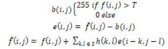

Berikut contoh filter yang dikembangkan oleh Floyd-Steinberg:

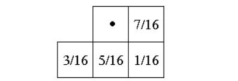

Keterangan:

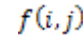 
 = _pixel_ pada posisi (i,j) yang diinputkan

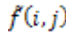 
 = penjumlahan dari _input pixel_ dan _diffused error_

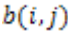 
 = _quantized pixel value_

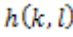 
 = _diffusion filter_ yang dimana 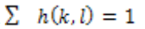 

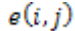 
 = selisih dari nilai dari _pixel_ baru dengan
_quantized pixel_ value  

Berikut adalah contoh kode program pada _error diffusion_:
```matlab% Program MATLAB untuk Floyd-Steinberg Error Diffusion Dithering
clear;
clc;


img = imread('4.1.03.tiff');
if size(img,3) == 3
    img = rgb2gray(img);  
end
img = double(img) / 255;

[rows, cols] = size(img);
output_img = img;  
kernel = [0 0 7; 3 5 1] / 16;
for i = 1:rows
    for j = 1:cols
        old_pixel = output_img(i, j);

        % Kuantisasi nilai piksel (thresholding)
        if old_pixel > 0.5
            new_pixel = 1;
        else
            new_pixel = 0;
        end
        output_img(i, j) = new_pixel;
        quant_error = old_pixel - new_pixel;
        if j + 1 <= cols  % Piksel kanan (7/16)
            output_img(i, j + 1) = output_img(i, j + 1) + quant_error * 7/16;
        end

        if i + 1 <= rows
            if j - 1 >= 1  % Piksel kiri-bawah (3/16)
                output_img(i + 1, j - 1) = output_img(i + 1, j - 1) + quant_error * 3/16;
            end

            % Piksel bawah (5/16)
            output_img(i + 1, j) = output_img(i + 1, j) + quant_error * 5/16;

            if j + 1 <= cols  % Piksel kanan-bawah (1/16)
                output_img(i + 1, j + 1) = output_img(i + 1, j + 1) + quant_error * 1/16;
            end
        end
    end
end
figure;
subplot(1, 2, 1), imshow(img, []), title('Gambar Grayscale Asli');
subplot(1, 2, 2), imshow(output_img, []), title('Hasil Floyd-Steinberg Error Diffusion');
imwrite(output_img, 'output_image.png');

```
Berikut adalah output dari kode program tersebut:
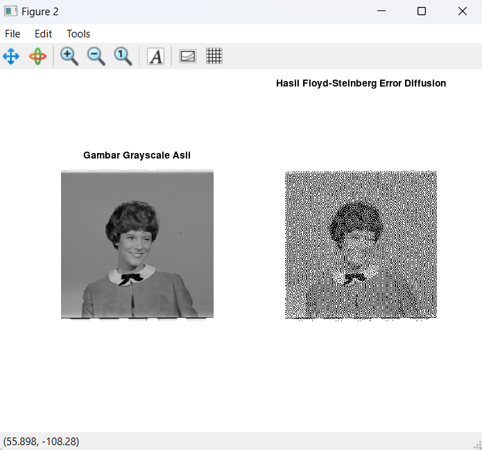 
2. **_Patterning_**

Patterning adalah yang paling sederhana dari tiga teknik untuk menghasilkan gambar halftoning digital. Teknik ini menghasilkan gambar dengan resolusi spasial yang lebih tinggi daripada gambar sumber. Jumlah sel halftone gambar output sama dengan jumlah piksel gambar sumber. Namun demikian, setiap sel halftone dibagi lagi ke dalam ukuran 4x4. Tiap nilai piksel input diwakili oleh jumlah kotak terisi yang berbeda dalam sel halftone. Karena ukuran 4x4 hanya dapat merepresentasikan 17 tingkat intensitas yang berbeda, maka gambar sumber harus dikuantisasi.

<figure>
  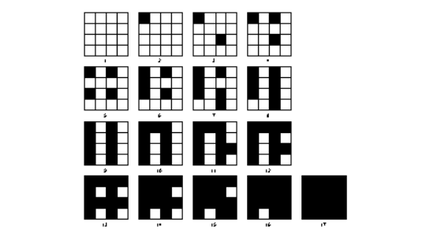
  <figcaption>Matriks pola rekursif Rylander</figcaption>
</figure>
<br>
<figure>
  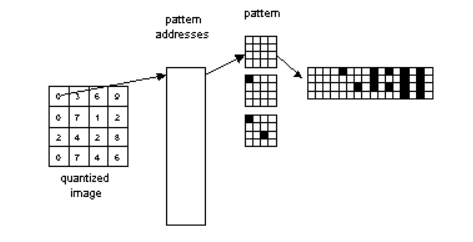
  <figcaption>Operasi patterning</figcaption>
</figure>
<br>

Berikut adalah kode program pada _patterning_:

```matlab
clc;
clear;

image = imread('4.1.03.tiff');
image = im2double(image);

gridSize = 10;


[rows, cols] = size(image);

halftoneImage = zeros(rows, cols);

for i = 1:gridSize:rows-gridSize+1
    for j = 1:gridSize:cols-gridSize+1
        block = image(i:i+gridSize-1, j:j+gridSize-1);
        avgIntensity = mean(block(:));

        radius = round(avgIntensity * (gridSize / 2));

        [xGrid, yGrid] = meshgrid(1:gridSize, 1:gridSize);
        center = gridSize / 2;
        circle = sqrt((xGrid - center).^2 + (yGrid - center).^2) <= radius;

        halftoneImage(i:i+gridSize-1, j:j+gridSize-1) = circle;
    end
end

figure;
subplot(1, 2, 1);
imshow(image); title('Original Image (Grayscale)');

subplot(1, 2, 2);
imshow(halftoneImage); title('Halftone Patterning');
```
Berikut adalah tampilan outputnya:

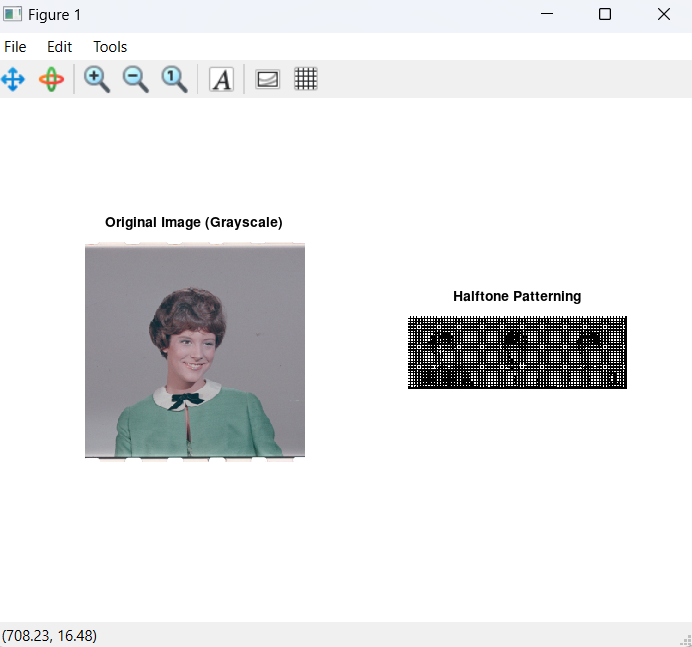

3. **_Dithering_**

Teknik lain yang digunakan untuk menghasilkan gambar halftoning digital adalah dithering. Tidak seperti patterning, dithering menciptakan gambar output dengan jumlah titik yang sama dengan jumlah piksel dalam gambar sumber. Dithering dapat dianggap sebagai _thresholding_ gambar sumber dengan matriks _dither_. Matriks diletakkan berulang kali di atas gambar sumber. Di mana pun nilai piksel gambar lebih besar daripada nilai dalam matriks, titik pada gambar output akan terisi. Masalah yang terkenal dari dithering adalah menghasilkan artefak pola yang diperkenalkan oleh matriks _thresholding_ yang tetap. Berikut adalah contoh operasi _dithering_:

<figure>
  
  <figcaption>Matriks pola rekursif Rylander</figcaption>
</figure>
<br>


Berikut adalah kode program dithering:

```matlab
img = imread('4.1.03.tiff');
gray = rgb2gray(img);
[m, n] = size(gray);
dithered_img = zeros(m, n);

for i = 1:m
    for j = 1:n
        oldPixel = gray(i, j);
        newPixel = round(oldPixel / 255) * 255;
        dithered_img(i, j) = newPixel;
        quant_error = oldPixel - newPixel;
        if j+1 <= n
            gray(i, j+1) = gray(i, j+1) + quant_error * 7 / 16;
        end
        if i+1 <= m && j-1 >= 1
            gray(i+1, j-1) = gray(i+1, j-1) + quant_error * 3 / 16;
        end
        if i+1 <= m
            gray(i+1, j) = gray(i+1, j) + quant_error * 5 / 16;
        end
        if i+1 <= m && j+1 <= n
            gray(i+1, j+1) = gray(i+1, j+1) + quant_error * 1 / 16;
        end
    end
end

imshow(uint8(dithered_img));
```

Berikut adalah hasil outputnya:


4. **_Ordered Dithering_**

_Ordered dithering_ dilakukan dengan membandingkan tiap blok dari citra asli dengan sebuah matriks pembatas (matriks threshold) yang disebut dengan matriks dither. Masing-masing elemen dari blok asli dikuantisasi sesuai dengan nilai batas pada pola dither. Nilai-nilai pada matriks dither adalah tetap, tetapi bisa bervariasi sesuai dengan jenis citra.

Untuk setiap matriks pembatas, terdapat _threshold_ matriks yang sesuai digunakan untuk membuat citra _halftone_. Nilai threshold matriks dapat ditentukan dari pembatas matriks I (i,j) dengan persamaan:

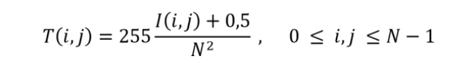

Keterangan:

T(i,j) = Matriks _threshold_

I(i,j) = Matriks pembatas/_dither_

N<sup>2</sup> = Jumlah elemen pada matriks

Citra asli memiliki matriks lebih besar dari pada matriks _threshold_, maka pola dither dilakukan berkala atau secara terus menerus terhadap seluruh _pixel_ citra. Secara spesifik operasi dapat dilihat pada persamaan:

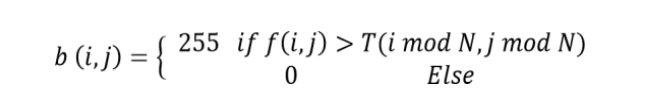

Keterangan:

b(i,j) = Matriks hasil _halftoning_

T(i,j) = Matriks _threshold_

f(i,j) = Matriks citra

<br>
<br>
<br>

<div align="center">

### DAFTAR PUSTAKA

</div>

Ortega-Sánchez, N, et al. (2020).  An Evolutionary Approach to Improve the Halftoning Process._Mathematics_,  _8(9)_, 1-23.

Raharjo, W. S. & Aguswahyudi, D. (2016). Implementasi Skema Meaningful Sharing pada Kriptografi Visual Berwarna untuk Digital Safe Deposit Box. _ULTIMATICS_, _8(1)_, 16-22.

Stefanus, Tony, & Teny H. (2016). APLIKASI HALFTONE QR-CODE DENGAN METODE ORDERED DITHERING. _Seminar Nasional Sistem Informasi Indonesia_, 353-358.

